# Clipping Rasters in QGIS

This tutorial covers two methods for clipping raster datasets in QGIS.

**Table of Contents**

* [Introduction](#introduction)
* [Set up a working environment](#set-up-a-working-environment)
	+ [Step 1 - Download the DEM dataset](#step-1---download-the-dem-dataset)
	+ [Step 2 - Download the City of Toronto boundary file](#step-2---download-the-city-of-toronto-boundary-file)
	+ [Step 3 - Set up a working directory](#step-3---set-up-a-working-directory)
* Clipping Rasters - Two ways
	+ [Clipping Rasters - Using a mask](#clipping-rasters---using-a-mask)
	+ [Clipping Rasters - Export data](#clipping-rasters---export-data)

## Introduction

Clipping rasters allows you to only work on or display a certain area of
interest. It could be defined by a boundary from a vector shapefile, or
it could be defined by the extent of the window.

## Set up a working environment

In this tutorial, we will be working with the Digital Elevation Model
(DEM) from Government of Canada's Geospatial Data, as well as the City
of Toronto Former Municipality Boundaries file from City of Toronto Open
Data Catalogue. Digital Elevation Model is a raster dataset that
represents the surface of elevations. You can find a more detailed
explanation of a DEM on the Esri documentation page.

## Step 1 - Download the DEM dataset

First, download the Digital Elevation Model. There are multiple sources
where you can retrieve Digital Elevation Models. This tutorial will lead
you to download the raster dataset from Government of Canada's
Geospatial Data Extraction website.

Alternative sources to download DEMs are provided at the end of this
tutorial.

In the "Find a location" tab, search for "Toronto". Choose the "Toronto,
York, Ontario - City" option and zoom to this selection on the map.

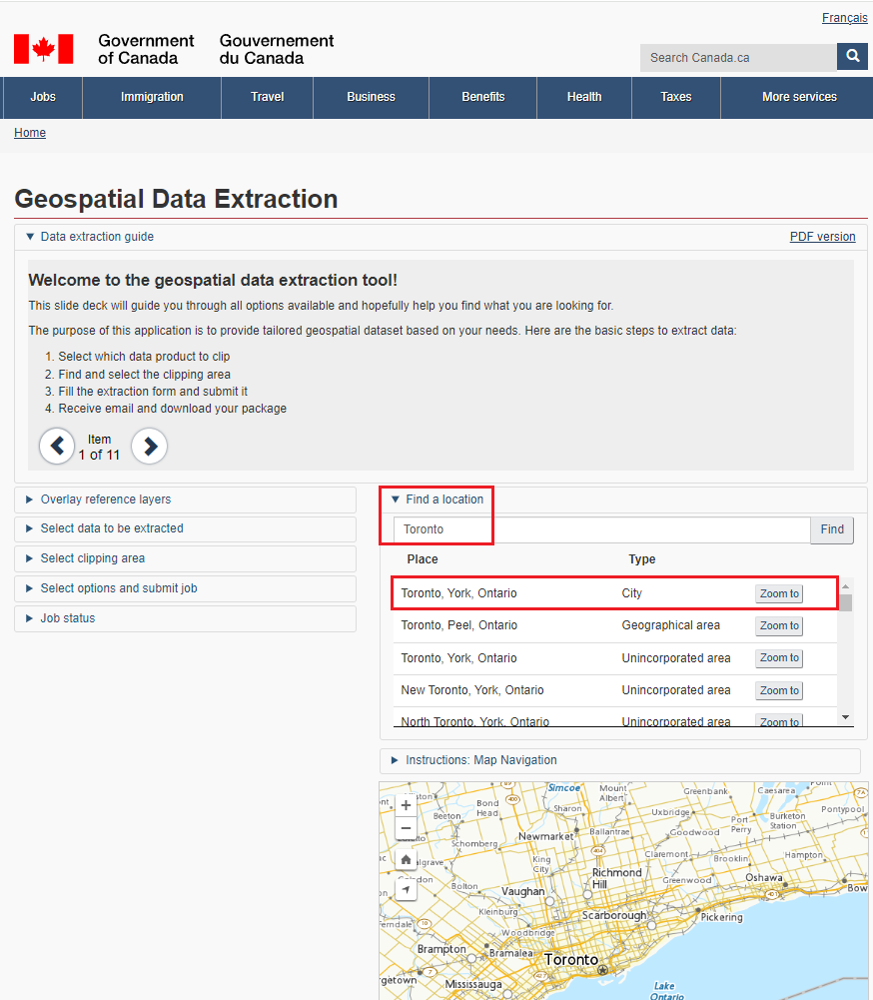

Then, make sure you set the clipping area to the "**Current Map
Extent**". After you check this box, the Map Navigation should highlight
the selected area in yellow.

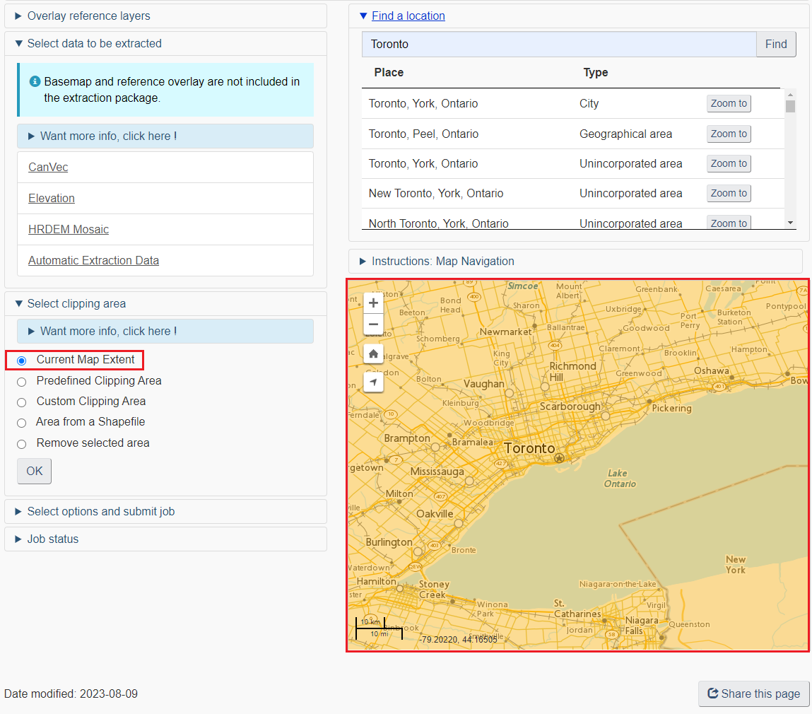
In the "**Select data to be extracted**" tab, select "**Elevation**".

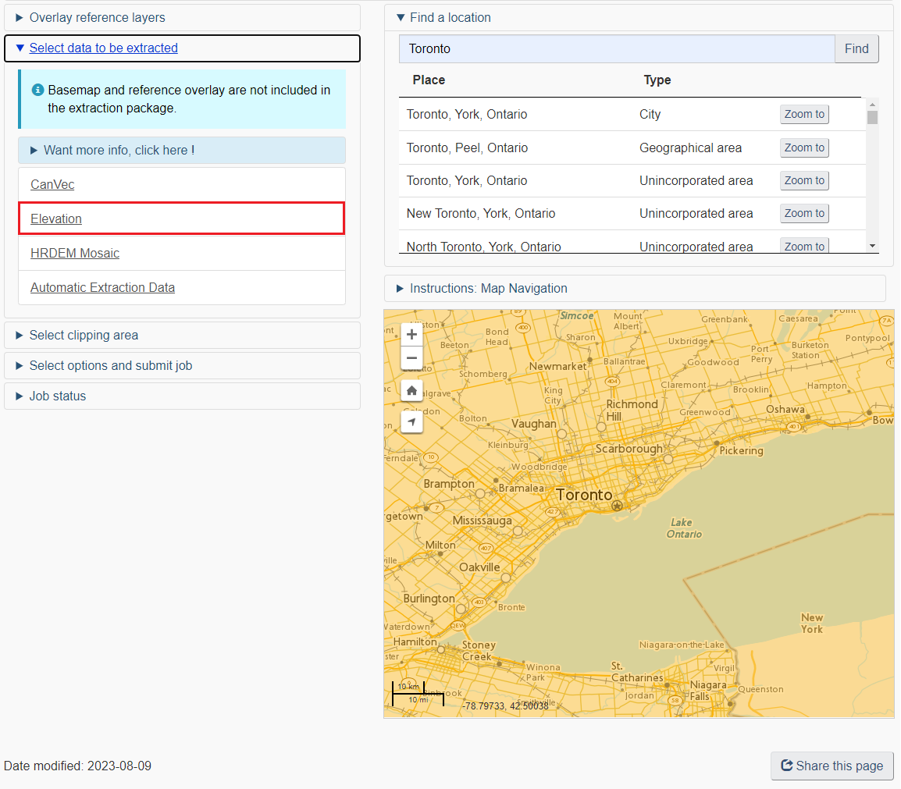
In the "Select options and submit job" tab, select "**Canadian Digital
Elevation Model**". Leave the polygon extent as it has already set to
the Toronto boundary. For product, select only the "**Digital Elevation
Model (DEM)**". Choose the **WGS84** coordinate system for this
tutorial. Leave the image resolution as default (20m), and input your
email address to download the raster dataset.

You will be able to see the job status on the website. Usually the
request is processed immediately but sometimes it might take a few hours
if the volume for requests are very high. Check your email for the
download link. In the email you received, copy the link ending with
".zip" in a new tab in the browser. Click "Enter" and the file will
start to download.

## Step 2 - Download the City of Toronto boundary file

**City of Toronto's open data catalogue** is a great source to access
the a variety of data from the municipal government. You can search from
the [City of Toronto's Open Data Catalogue
portal](https://open.toronto.ca/catalogue/).

For the first task, search for the "**Former Municipality Boundaries**".

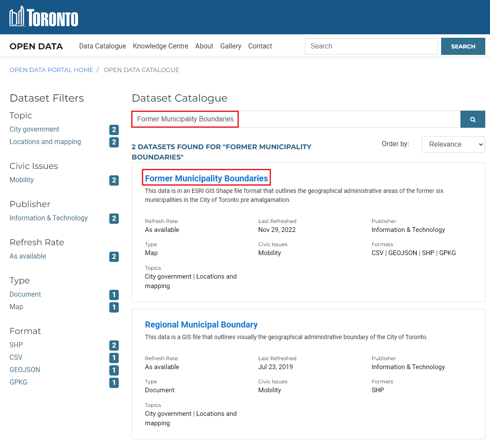
Also, download the dataset with the **WGS84** coordinate system for this
dataset to be consistent with the DEM we downloaded.

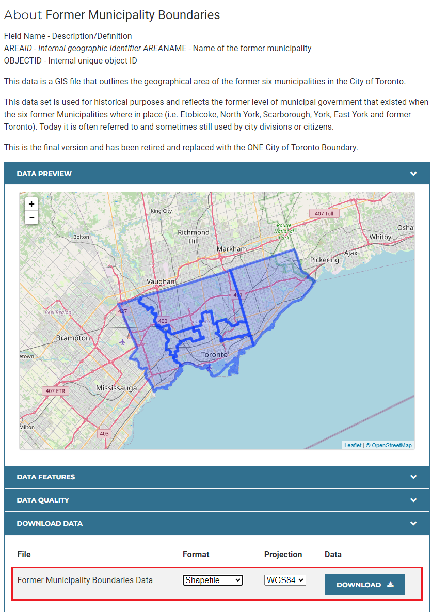

## Step 3 - Set up a working directory

To ensure that all of your data are saved properly, create a folder to
save all your data and maps in. Make sure you are not including spaces
in all the folder names in the directory, because folders with spaces
might result in unexpected errors.

After creating folders, extract the data you just downloaded to your
working folder. Repeat the same steps for other zipped datasets.

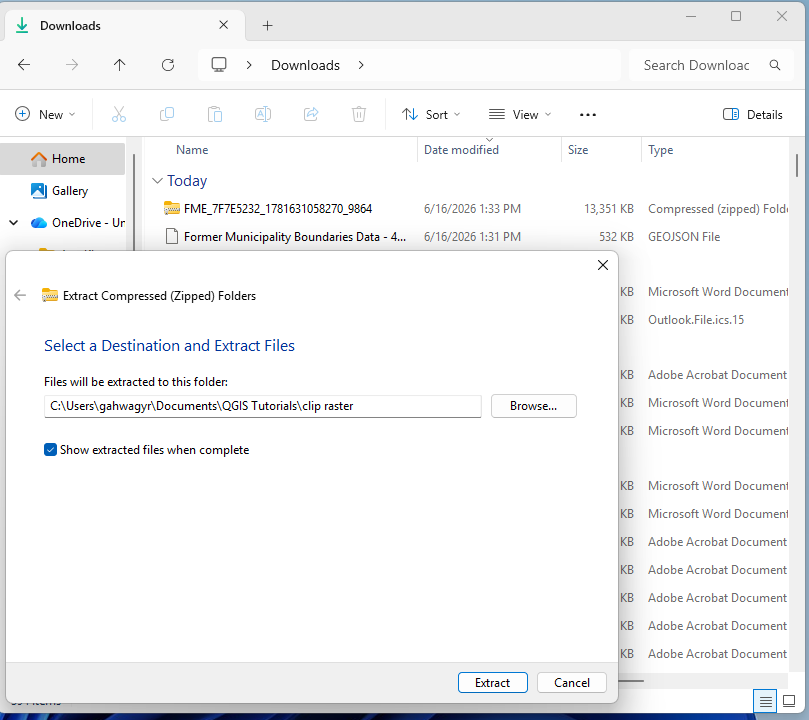

Open QGIS, Click on Project → Save and browse to the same folder you
data is stored.

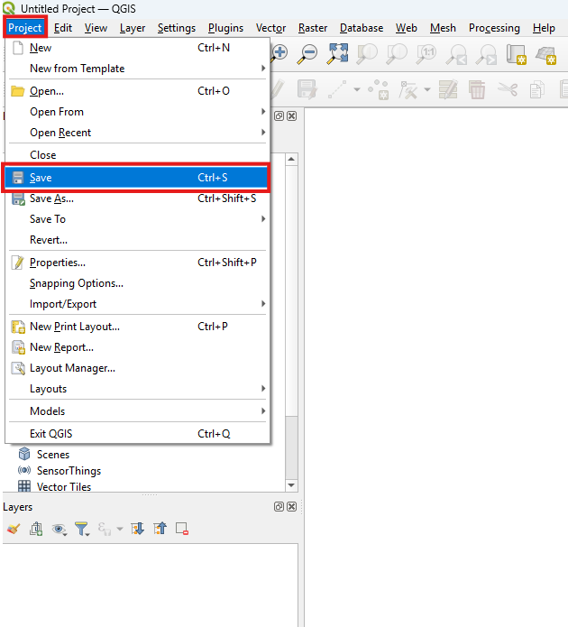

Name the project and click Save.

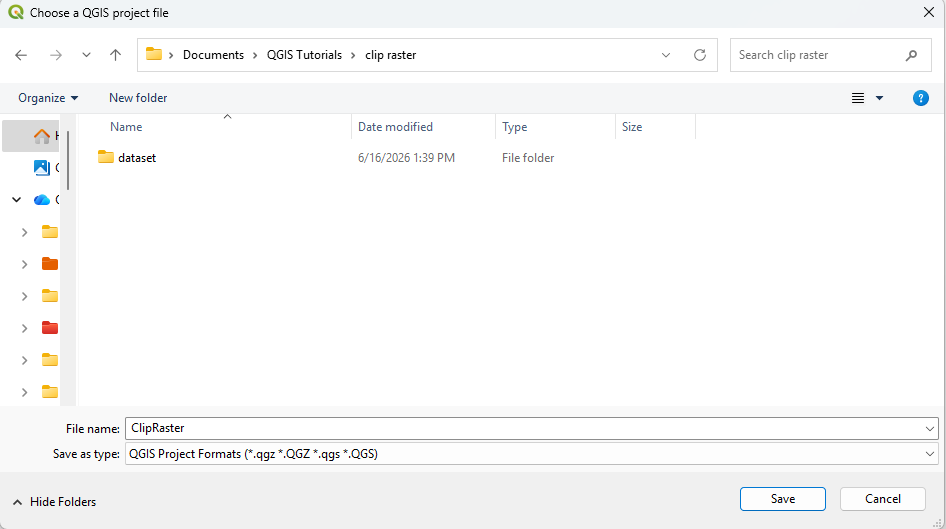

## Add a base map

If you do not have QuickMapServices Plugin already, see this tutorial
for more information:
<https://mdlutoronto.github.io/qgis-mapping-spatial-analysis-intro/05-plugins/>

Or follow these steps:

- Click Plugins on the QGIS menu. Choose Manage and Install Plugins.

- In the Plugin Manager window, click the All tab. Search for
  quickmapservices.

- Select the NextGIS QuickMapServices item from the results.

- Click Install Plugin.

- Now click Web in the QGIS menu. Choose QuickMapServices. Choose any
  base map you like here we chose Esri → Newspaper Map

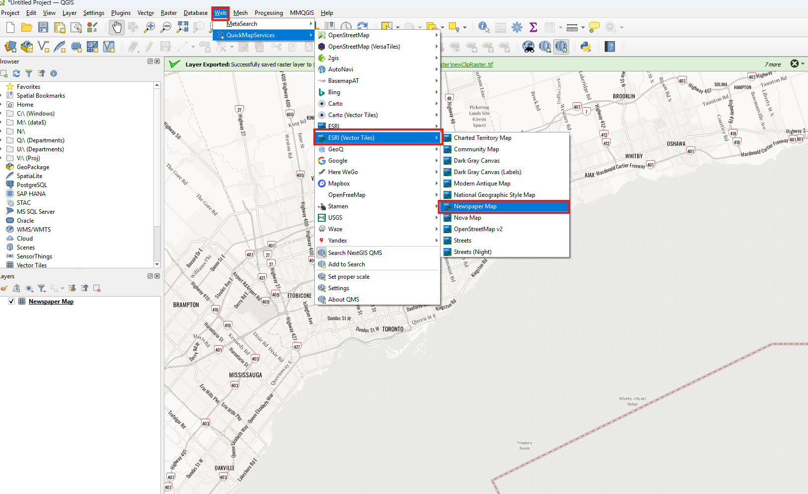

## Add data to the map

There are two ways to add rasters and data to maps demonstrated here:

### Add data from menu

- Select Layer → Add Layer → Add Raster Layer from the menu.

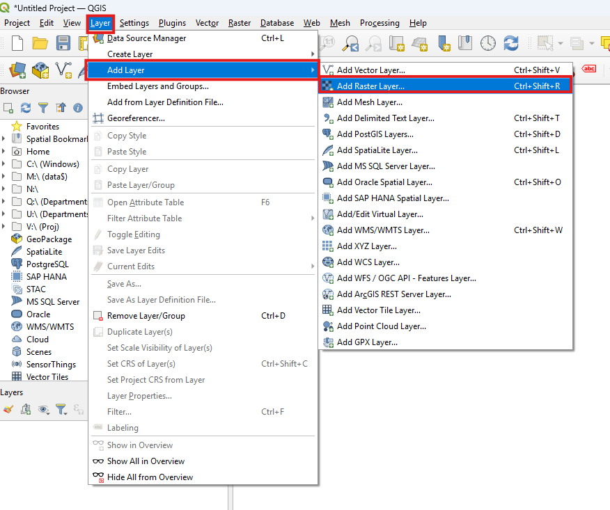

- In the Data Source Manager window select Browser then navigate to
  where you saved the DEM data. Double click on the DEM.tif for it to
  appear in the map. Close the Data Source Manager.

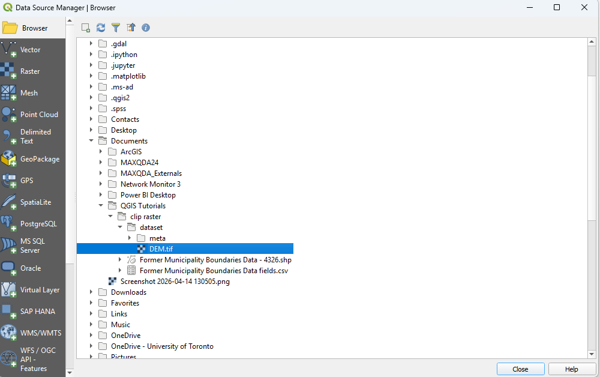

### Add data by dragging

- Another way to add data to the map is to simply drag it from the
  folder to the map. Open the folder containing the Former Municipality
  Boundaries Data - 4326.shp and drag the shape file to the main map or
  the Layers pane to automatically add it to the map.

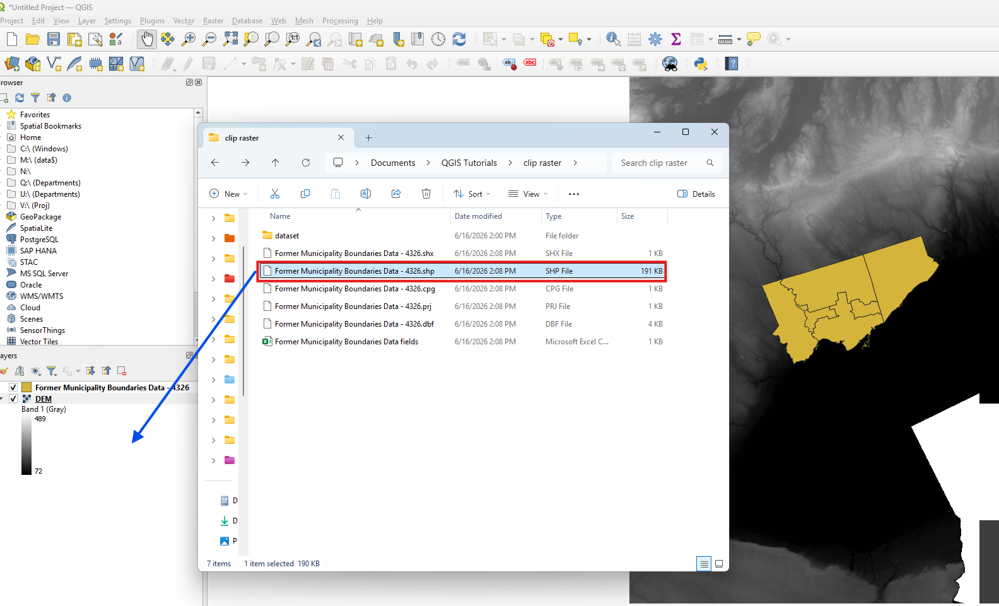

On the Layers pane on the left, you can adjust the drawing order
(display order) of the two dataset if you want to have the boundaries
layer on top of the DEM. Simply drag the layers up and down in the list
to change the order to display them.

## Clipping Rasters - Two ways

There are multiple ways to clip a raster in QGIS. We will explore two main
ways here.

### Clipping Rasters - Using a mask

The first method to clip a raster is by using a mask or a shapefile to
clip it to the same shape as the mask.

- On the QGIS menu, click on Raster → Extraction → Clip Raster by
  Mask Layer

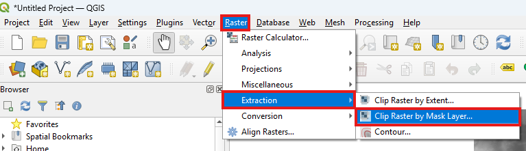

- A new window will pop-up where the Input layer (the layer you want to
  clip) should be the DEM. Mask layer is the Former Municipality
  Boundaries Data which will clip raster to the shape of this layer.

- Optionally, you can check the options for "Keep resolution of input
  layer" and we will leave another option to default.

- Click run and a new window will open that shows complete.

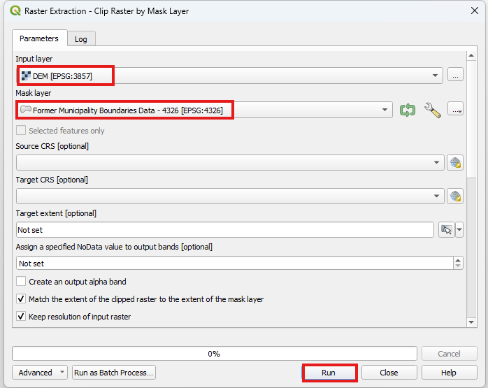

The raster is now clipped to the shape of the mask and should look like
this:

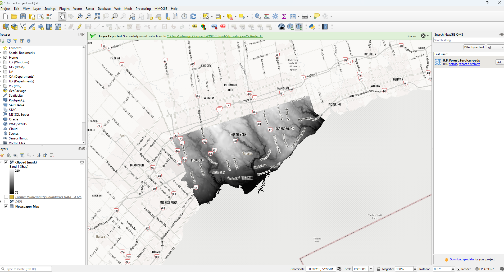

### Clipping Rasters - Export Data

You can also zoom to the extent you wish to be working on and clip your
dataset based on your zoomed extent. Let's say you are specifically
interested in Toronto's islands and port lands.

- Zoom in desired area.

- Right click on the DEM that you wish to crop.

- Choose Export then click on Save As\...

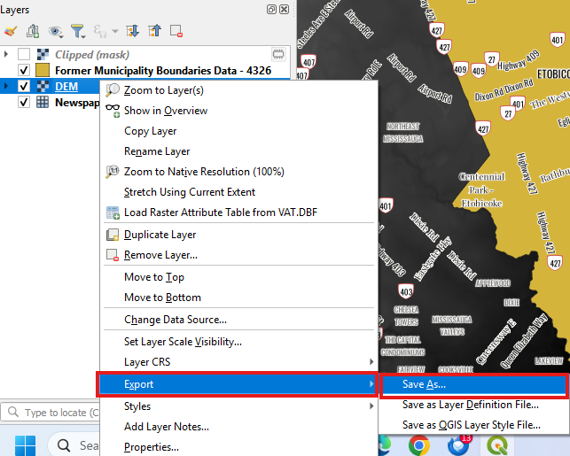

- A new window will pop up. Next to the File name click on the square
  with three dots. Browse to your project folder and type in the name of
  the new clipped raster. Click on Save

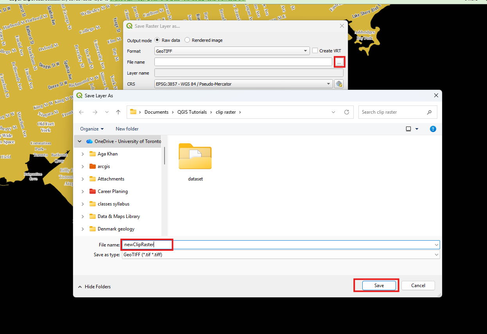

- Click on Map Canvas Extent to crop to the zoomed map. Make sure "add
  saved file to map" is checked. Click on OK.

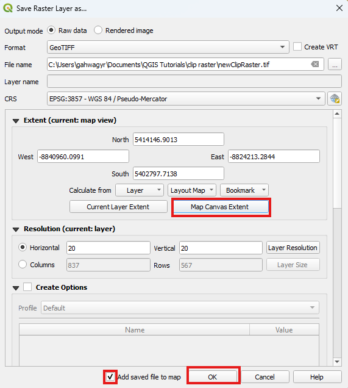

The new map extent should look like this:

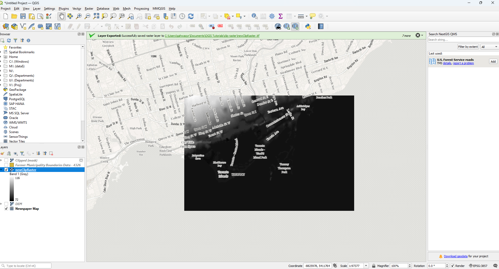